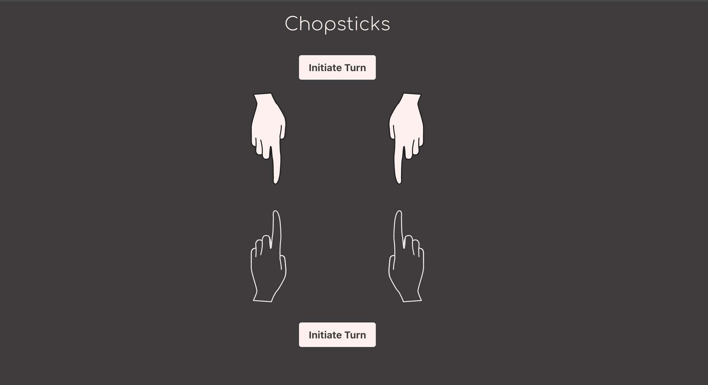

# Chopsticks

Chopsticks is a two-player hand game that involves tapping and exchanging the fingers of both hands to score points and ultimately defeat the opponent. The game continues until one player has both hands eliminated, making the other player the winner.

Technologies: React, Tailwind CSS

## Home page

